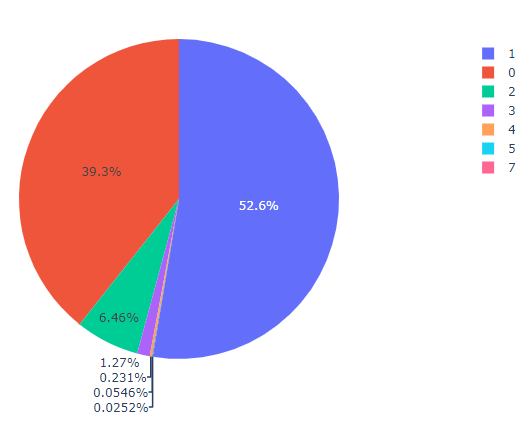
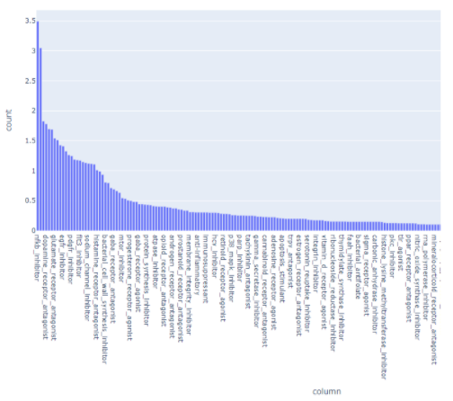
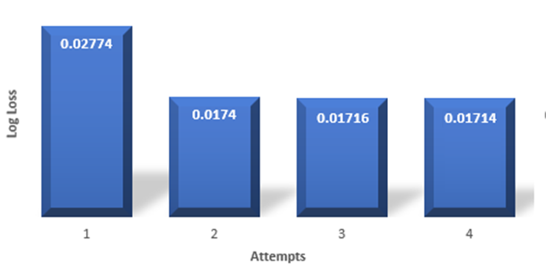
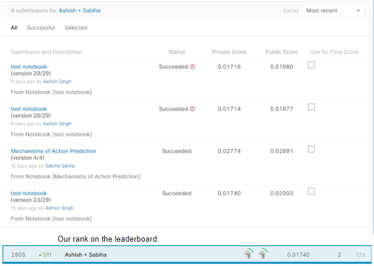

# Drugs' Mechanism of Action Prediction

Problem Statement
=================

The goal of this project is to predict multiple targets of the MoA response(s)  
of different samples given various inputs. The project comes with a unique   
imbalanced dataset that combines gene expression and cell viability data along  
with MoA annotations for more than 5,000 unique drugs as mentioned earlier. The   
dataset describes the responses of 100 different types of human cells to various  
drugs. Those response patterns will be used to classify the MoA reponse. The  
evaluation metric is the mean column wise log loss. The dataset has been split  
into testing and training subsets. Hence, the task is to use the training   
dataset to develop an algorithm that automatically labels each case in the test  
set as one or more MoA classes. Since drugs can have multiple MoA annotations,  
the task is formally a multi-label classification problem.

Notations
---------

For every sample, represented by sig\_id, it is required to predict the   
probability that the sample had a positive response for each [MoA] target.   
For N sig\_id rows and M [MoA] targets, there should be N x M predictions  
and the prediction will be scored by the log loss formula mentioned in   
section 5.2 where,

-   N is the number of sig\_id observations in the test data (i=1,…,N)
-   M is the number of scored MoA targets (m=1,…,M)
-    i,m is the predicted probability of a positive MoA response for a sig\_id
-   yi,m is the ground truth, 1 for a positive response, 0 otherwise
-   log() is the natural (base e) logarithm

Methods and Techniques
======================

Preparation and Data Overview
-----------------------------

We started our project with the basic preparations and analysis of the given  
dataset. We loaded necessary libraries to begin with the solution and loaded   
the data using Pandas. Then we had an overview of the provided dataset to  
decide what needs to be done during preprocessing.

### Data Overiew

| Dataset             | Samples       | Features     |
| --------------------|---------------|--------------|
| Train               | 23814         | 876          |
| Test                | 3982          | 876          |
| Scored Targets      | 23814         | 207          |
| Non-Scored Targets  | 23814         | 403          | 
| Sample Submissions  | 3982          | 207          |

Data Preprocessing
------------------

Preprocessing was a necessary step to get the data in a good shape. Since we   
were determined to implement neural networks, we ensured that the inputs were  
in a standard format. During preparations, we also ensured that there were no   
missing values. We removed the id column for the samples in the train dataset   
and test dataset which were represented as sig\_id. We extracted the gene   
expression features each denoted by \`\`g-“. and cell viability features each  
denoted by \`\`c-” separately. We also embedded the categorical features.

Model Building
--------------

### Used Libraries

-   NumPy
-   Pandas
-   SciKit-Learn
-   TensorFlow
-   XGBoost

### Methodology

We started building our model applying SVM and followed K-Means algorithmic   
approach. However these approaches exceeded the time limit set from Kaggle.   
We tried reducing features using principal component analysis (PCA) and then  
applied SVM and K-Means algorithms. Nonetheless, our methodology was not   
getting to the proper direction as per expected by Kaggle. We then tried to  
find some features of interest using t-distributed stochastic neighbor   
embedding (TSNE) to graph the data but we found nothing considerable. Then  
we moved on to applying the XGBoost method to extract important features   
and decided to implement a neural network. It reduced the features from 876  
to 821. At this point, we implemented the StratifiedKFold technique again.   
We designed a neural network in two hidden layers in between the input and   
output layer. We initially used Sigmoid as the activation function but however  
Relu gave us better results. We tried to optimize our results with   
hyperparameter tuning. We tested with varying epochs, dropouts and batch  
sizes. We used binary cross entropy as our log loss metric which was aligned  
with the evaluation metric set by Kaggle. Through multiple attempts we   
gradually developed our model that lowered the log loss and improved our  
rank on the Kaggle leaderboard.

Post Processing
---------------

We did a sanity check to ensure that the final submission file contains the   
prediction results as expected and all features and sample IDs are in good shape.

Discussion and Results
======================

Datasets
--------

-   **Training Dataset:** Features for the training dataset was provided in the   
    **train\_features.csv** file. This is a dataset with almost 900 columns. From   
the data description we came to know that features starting with \`\`g-" encode  
gene expression data and features starting with \`\`c-” implied cell viability   
data. There were total 772 gene expression and 100 cell viability features.   
Moreover, there were 3 more features. cp\_type feature incidated the sample   
treatment, cp\_time feature indicated the duration of treatment and cp\_dose   
feature encode dosage of the treatment. The sig\_id column was for   
identification of each sample.

-   **Scored Train Targets:** The binary MoA targets were provided in the   
    **train\_targets\_scored.csv** file that were scored. The target response  
    had over 200 different binary outputs giving a sparse matrix.

-   **Non-Scored Train Targets:** Additional non-scored binary targets, that  
    were neither predicted nor scored, were provided through   
    **train\_targets\_nonscored.csv** file. These additional targets contained  
    about 400 classes.

-   **Test Data:** The test data contained the same features as the train data,  
    and had about 3982 samples compared to the 23814 samples of the training data.  
The test dataset was provided through **test\_features.csv** file

Exloratory Data Analysis
------------------------

With reference to [6], we found that about 40% of samples had zeros in all   
columns and more than 50% have only one active target column shown in figure 1.   
Also, figure 2 shows that the biggest number of positive samples for 1 target  
column is 3.5%.

[fig: Number of activations in targets for every sample (in percent)]

[fig: Percent of positive records for every column in target]

As it is clearly visible from the analysis, the dataset provided to us was really imbalanced.

Evaluation Metrics
------------------

Log Loss was required by Kaggle so this was the only one used to justify the   
progression of our work. The scoring function used by Kaggle was following:

score = 

However, other measures such as accuracy, total compile time, epoch time, memory  
usage were considered in our overall approach while building the model. During   
the development of the neural network some settings in the NN gave high accuracy  
but very low validation. Nevertheless, this was clearly due to overfitting so   
high accuracy scores were not taken seriously. Total compile time was used to   
justify using GPU boosted ML models like XGboost and Tensorflow’s Keras. Using   
some libraries and machine learning techniques like oversampling, undersampling  
and measuring variances/distances required too much memory for a dataset this large.

Experimental Results
--------------------

All decisions made were based on comparing previous validation loss scores with  
new ones which were a result of modifications done in our project.

[fig: Log loss decreased with continued attempts]

With repeated modifications and development, we were able to improve our rank on  
Kaggle leaderboard

[fig: Kaggle Leaderboard Position]

Conclusion
==========

There were two major takeaways while doing this project. The first thing we   
learned was that a comprehensive exploratory data analysis is a significant   
task for setting up an efficient strategy, feature engineering and   
postprocessing. The second one is about overfitting issues. As we learned   
during the course, we realized practically as well while doing this project  
that overfitting is a great problem. Additionally, reading existing studies   
on the set of topics most directly related to solving such problems (like   
our Kaggle competition) makes understanding the problem statement faster and  
in more depth than without reading any research papers.

Direction for Future Work
-------------------------

This project was an interesting one to work on. Beyond the constraints,   
we would use biased and neutral representation of the dataset and feed it to a   
Convolutional Neural Network (CNN) to see what kind of results it produces.   
We would also like to create a function that can oversample and undersample   
the multilabel dataset. We would give deep reinforcement learning a try as we  
suspect that learning actively through some form of evaluation will yield better  
information to learn from rather than using supervised learning which is only  
instructive. A research can also be conducted to figure out a way to calculate   
similarities between microarray of gene expressions, cell viabilities and  
both combined.

References
==========

1.  https://www.kaggle.com/c/lish-moa/overview

2.  https://clue.io/connectopedia/glossary

3.  Zeng, L., Yu, Z., & Zhao, H. (2019). A Pathway-Based Kernel Boosting Method  
for Sample Classification Using Genomic Data. Genes, 10(9), 670.   
https://doi.org/10.3390/genes10090670

4.  Liu, S.; Xu, C.; Zhang, Y.; Liu, J.; Yu, B.; Liu, X.; Dehmer, M. Feature   
selection of gene expression data for Cancer classification using double   
RBF-kernels. BMC Bioinf. 2018, 19, 396.

5.  Dong, H., Xie, J., Jing, Z., and Ren, D. (2020). Variational Autoencoder  
for Anti-Cancer Drug Response Prediction. arXiv e-prints, arXiv:2008.09763

6.  https://www.kaggle.com/isaienkov/mechanisms-of-action-moa-prediction-eda/notebook
